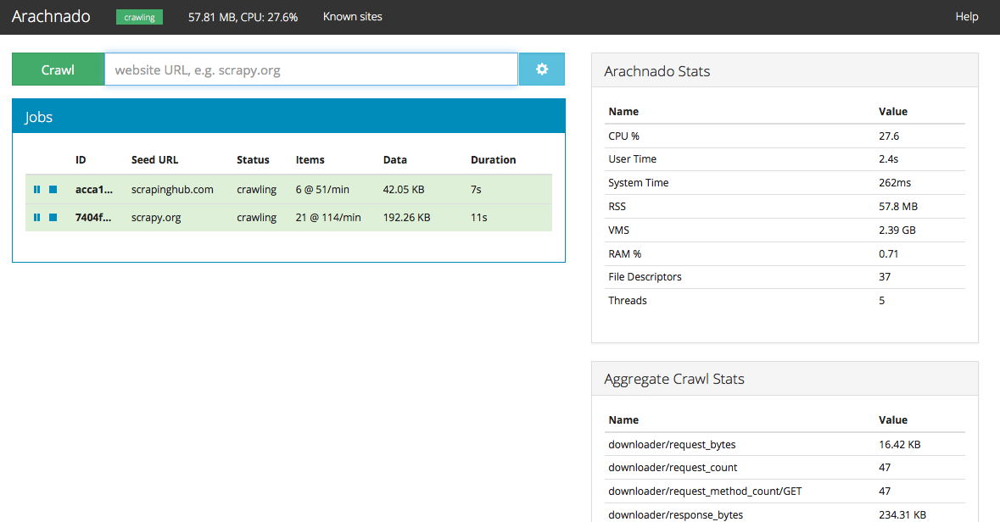
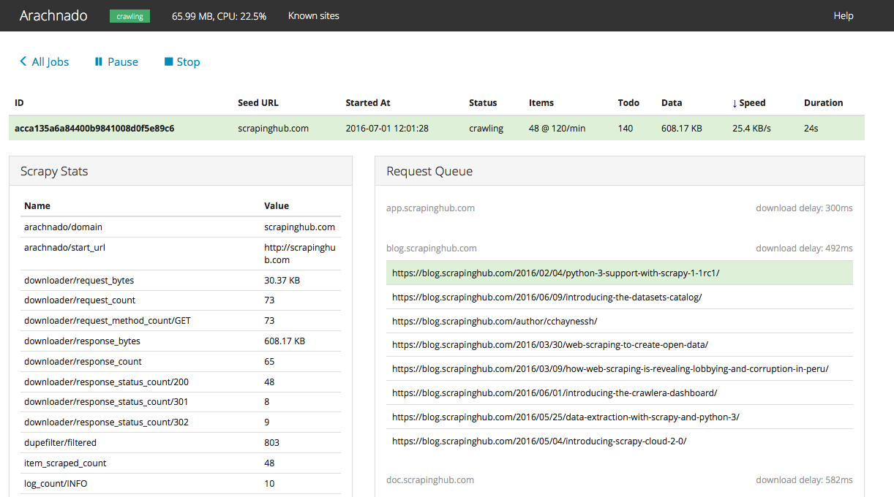

Arachnado
=========

Arachnado is a tool to crawl a specific website.
It provides a Tornado_-based HTTP API and a web UI for a
Scrapy_-based crawler.

License is MIT.

.. _Tornado: http://www.tornadoweb.org
.. _Scrapy: http://scrapy.org/

.. toctree::
   :maxdepth: 2

   intro
   config
   http-api
   json-rpc-api

Screenshots
-----------

Indices and tables
==================

* :ref:`genindex`
* :ref:`modindex`
* :ref:`search`

